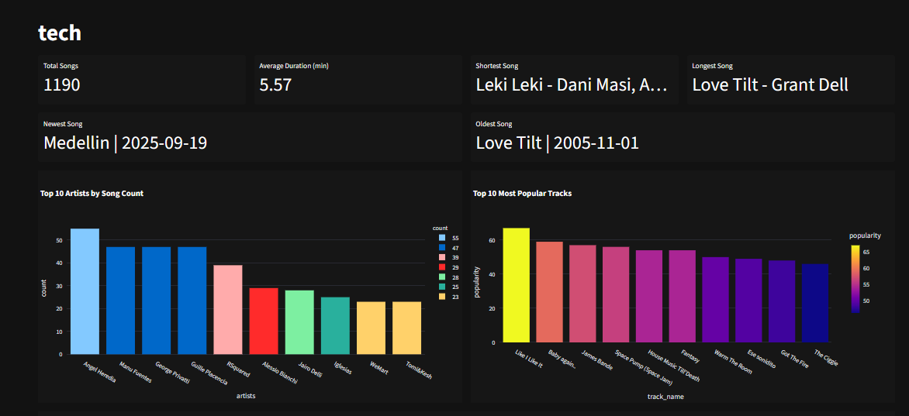
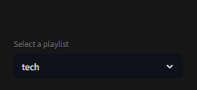

# Spotify ETL Project

This project extracts data from the Spotify API, performs the necessary transformations, and stores the results as CSV files in a destination folder. Finally, it generates interactive dashboards using **Streamlit**.

---

### The problem this project solved

Before I discovered [Streamlit](https://streamlit.io/), I built the project using Power BI for the dashboards. However, the dashboards couldn’t be automated — I had to create them manually for each playlist, which was very time-consuming. 

---


## How to Run

1. **Go to [Spotify for Developers Dashboard]([https://developer.spotify.com/dashboard](https://developer.spotify.com/dashboard))**
2. **Create a new app**. Once logged in, click **“Create an App”**, give it a name and description (anything you like), and save.
3. **Copy your credentials** from the app’s settings, copy the following values:

   - **Client ID**
   - **Client Secret**
   - **Redirect URI** (add `http://127.0.0.1:8888/callback` or any other URI you will use)
4. **Create a virtual environment**

   ```bash
   python -m venv spotify-env
   ```
5. **Activate it**

   ```bash
   .\spotify-env\Scripts\Activate.ps1
   ```
6. **Clone repo**

   ```
   https://github.com/fran-cornachione/SpotifyETL.git
   ```
7. **Install requirements**

   ```
   pip install -r requirements.txt
   ```
8. **Create an `.env` file, and save the following credentials there:**

   ```
   SPOTIFY_CLIENT_ID = 
   SPOTIFY_CLIENT_SECRET = 
   SPOTIFY_REDIRECT_URI = http://127.0.0.1:8888/callback (Or any other URI)
   ```
9. **Run script `main.py`**

   ```
   python main.py
   ```

You will now have all your playlists saved in the **data** folder, each playlist as a `.csv` file.

10. **Run script `dashboard.py`**

```
streamlit run dashboard.py
```

It will automatically take you to the Streamlit UI on your browser.

> *Now, you can see the analytics of any of your playlists.*

- Newest Song (by release date)
- Oldest Song (by release date)
- Total Songs
- Average Duration (min)
- Shortest Song
- Longest Song
- Top 10 Most Popular Tracks
- Top 10 Artists by Song Count (artists with the most amount of tracks in the playlist)

---




You can select a different playlist in the sidebar on the left.


